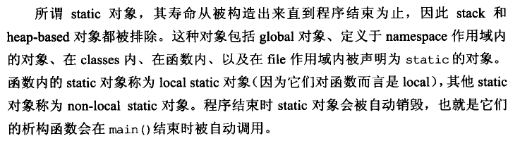

# 对象使用前初始化

确保在使用对象之前对其进行初始化。

C风格的array不保证初始化，而STL的vector会保证初始化。

赋值(assignment) VS 初始化(initilization)

```cpp
class PhoneNumber {...};
class ABEntry {
public:
    ABEntry(const string& name, const string& address
            const list<PhoneNumber>& phones) {
        theName = name;            // 非内置类型，在进入函数体之前已经初始化（调用默认构造）
        theAddress = address;      // 然后再赋值操作
        thePhones = pthones;       //
        numTimesConsulted = 0;     // 内置类型，无所谓
    }
private:
    string theName;
    string theAddress;
    list<PhoneNumber> thePhones;
    int numTimesConsulted;
};
```

替换为"成员初始化列表"，这里是将实参拿做各个成员变量构造函数的实参，这里调用Copy构造

```cpp
ABEntry::ABEntry(const string& name, const string& address
            const list<PhoneNumber>& phones) 
    :theName(name),
     theAddress(address),
     thePhones(pthones),
     numTimesConsulted(0)
{}
```

也可以使用每个成员调用默认构造

```cpp
ABEntry::ABEntry(const string& name, const string& address
            const list<PhoneNumber>& phones) 
    :theName(), theAddress(), thePhones(), numTimesConsulted(0)
{}
```

还有一种情况必须使用成员初始化列表，即成员变量是 const 或 reference，这种必须有初始值，且不能被赋值

成员初始化列表的初始化总是以声明的顺序被初始化的。

## non-local static对象



* 函数内定义的 `static` 对象成为 `local static` 对象
* 其他 `static` 对象称为 `non-local static` 对象

### 示例
```c++
class FileSystem {
public:
    std::size_t numDisks() const { return numDisks_; }
    ...
};
extern FileSystem tfs;
```

```c++
// 程序库客户创建
class Directory{
public:
    Directory( params ) { std::size_t disks = tfs.numDisks(); }
    ...
};
Directory tempDir(params);
```

如果在创建 tempDir 对象时，tfs 对象还未初始化，那么 tempDir 对象将使用一个未定义的值。如果解决，使用单例，将 `non-local static` 对象用 `local static` 对象替代。
```c++
class FileSystem {...};
FileSystem& tfs() {
    static FileSystem fs; // local static对象
    return fs;
}
```